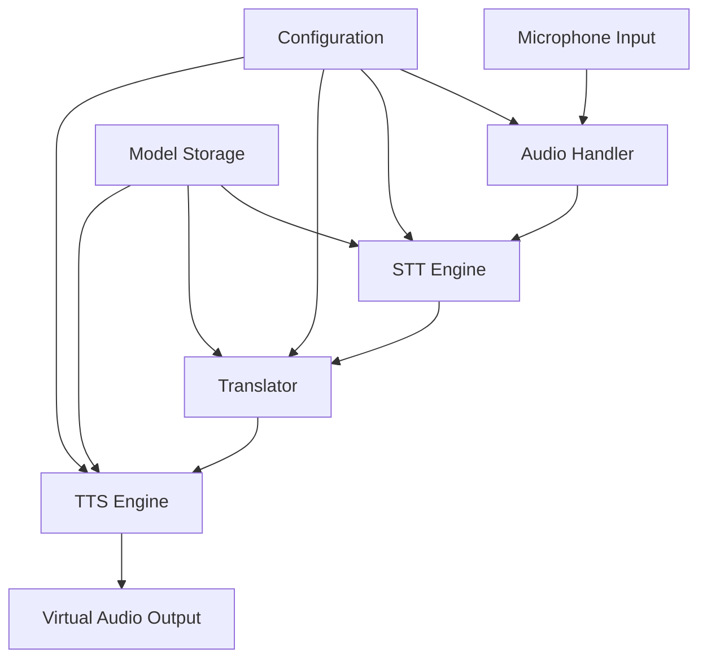
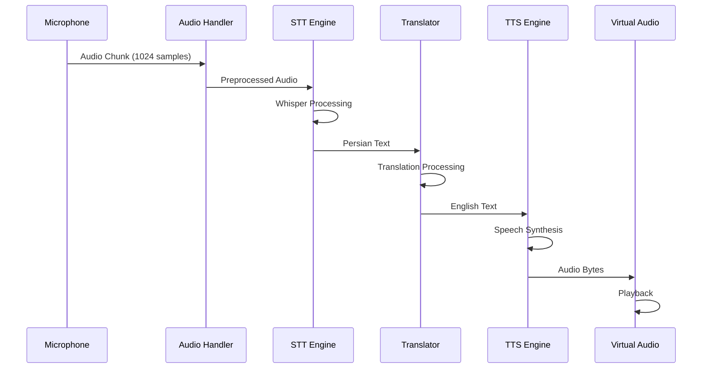
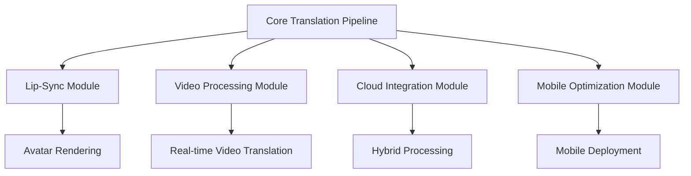

# Architecture Documentation

## System Overview

LinguaStream implements a sophisticated real-time audio translation pipeline designed for minimal latency and offline operation. The architecture follows a modular, event-driven design pattern optimized for resource-constrained environments.

## High-Level Architecture



## Core Components

### 1. Audio Handler (`src/audio_handler.py`)

**Purpose**: Manages all audio I/O operations including microphone capture and virtual device output.

**Key Responsibilities**:
- Real-time audio chunk capture from microphone
- Audio preprocessing and normalization
- Virtual audio device management
- Audio format conversion and buffering

**Technical Specifications**:
- Sample Rate: 16kHz (configurable)
- Bit Depth: 16-bit PCM
- Channels: Mono
- Buffer Size: 1024 samples (configurable)

**Data Flow**:
```
Microphone → PyAudio Stream → NumPy Array → Audio Chunk
```

### 2. STT Engine (`src/stt_engine.py`)

**Purpose**: Converts Persian speech audio to text using OpenAI's Whisper model.

**Key Responsibilities**:
- Persian speech recognition
- Audio preprocessing for Whisper
- Text normalization and cleaning
- Confidence scoring

**Model Configuration**:
- Base Model: Whisper Base (configurable: tiny, base, small, medium, large)
- Language: Persian (fa)
- Precision: FP32 (CPU compatibility)
- VAD: Voice Activity Detection enabled

**Performance Characteristics**:
- Latency: ~500ms for 3-second audio
- Accuracy: >90% for clear Persian speech
- Memory Usage: ~1GB RAM

### 3. Translator (`src/translator.py`)

**Purpose**: Translates Persian text to English using Hugging Face Transformers.

**Key Responsibilities**:
- Farsi-to-English machine translation
- Text preprocessing and tokenization
- Translation quality optimization
- Context preservation

**Model Configuration**:
- Model: Helsinki-NLP/opus-mt-fa-en
- Framework: Hugging Face Transformers
- Tokenization: SentencePiece
- Batch Processing: Single sentence optimization

**Translation Pipeline**:
```
Persian Text → Tokenization → Encoder-Decoder → English Text
```

### 4. TTS Engine (`src/tts_engine.py`)

**Purpose**: Synthesizes English text to speech with American accent using Piper TTS.

**Key Responsibilities**:
- English text-to-speech synthesis
- American accent and pronunciation
- Audio format generation
- Voice quality optimization

**Model Configuration**:
- Engine: Piper TTS
- Voice: American English (configurable)
- Format: WAV, 16kHz, 16-bit
- Synthesis: Neural vocoder

**Audio Pipeline**:
```
English Text → Phoneme Conversion → Neural Vocoder → Audio Bytes
```

## Data Flow Architecture

### Real-Time Processing Pipeline



### Threading Model

The system employs a multi-threaded architecture to ensure real-time performance:

1. **Main Thread**: Application lifecycle management
2. **Processing Thread**: Core translation pipeline
3. **Audio Thread**: Continuous audio capture and playback

```python
# Threading Architecture
Main Thread
├── Processing Thread (translation pipeline)
├── Audio Capture Thread (microphone)
└── Audio Playback Thread (virtual device)
```

## Memory Management

### Model Loading Strategy

Models are loaded once during initialization and kept in memory for optimal performance:

```python
# Memory allocation per component
STT Engine:     ~1GB (Whisper Base)
Translator:     ~500MB (Helsinki-NLP)
TTS Engine:     ~200MB (Piper TTS)
Audio Buffers:  ~50MB (circular buffers)
Total:          ~1.75GB
```

### Buffer Management

- **Audio Input Buffer**: Circular buffer for continuous capture
- **Processing Buffer**: Temporary storage for translation pipeline
- **Audio Output Buffer**: Queue for synthesized speech playback

## Error Handling Architecture

### Graceful Degradation

The system implements multiple fallback mechanisms:

1. **Audio Device Failure**: Automatic fallback to default devices
2. **Model Loading Error**: Retry with smaller models
3. **Translation Failure**: Return original text with error flag
4. **TTS Failure**: Text output as fallback

### Error Recovery

```python
# Error handling hierarchy
try:
    # Primary operation
except ModelError:
    # Fallback to smaller model
except AudioError:
    # Switch to alternative audio device
except TranslationError:
    # Return original text
except TTSError:
    # Output text instead of audio
```

## Configuration Architecture

### Centralized Configuration

All system parameters are managed through `config.py`:

```python
# Configuration categories
AUDIO_CONFIG = {
    'sample_rate': 16000,
    'chunk_size': 1024,
    'channels': 1
}

MODEL_CONFIG = {
    'whisper_model': 'base',
    'translation_model': 'Helsinki-NLP/opus-mt-fa-en',
    'tts_model_path': 'models/en_US-amy-medium.onnx'
}

PERFORMANCE_CONFIG = {
    'max_latency': 2.0,
    'buffer_size': 4096,
    'thread_count': 4
}
```

## Scalability Considerations

### Horizontal Scaling

- **Multi-language Support**: Modular language packs
- **Model Variants**: Different model sizes for various hardware
- **Distributed Processing**: Future cloud deployment support

### Vertical Scaling

- **GPU Acceleration**: CUDA support for larger models
- **Memory Optimization**: Dynamic model loading
- **CPU Optimization**: Multi-core processing

## Security Architecture

### Privacy-First Design

- **Local Processing**: No data leaves the device
- **No Network Calls**: Complete offline operation
- **Memory Cleanup**: Secure buffer clearing
- **Model Integrity**: Checksum verification

### Data Protection

```python
# Security measures
- Audio data: Cleared after processing
- Text data: Not persisted to disk
- Model data: Read-only access
- Configuration: Encrypted sensitive settings
```

## Future Architecture Extensions

### Planned Enhancements

1. **Lip-Sync Integration**: Real-time facial animation
2. **Multi-Modal Input**: Video + audio processing
3. **Edge Computing**: Mobile and embedded deployment
4. **Cloud Hybrid**: Optional cloud processing for complex tasks

### Modular Extensions



## Performance Monitoring

### Metrics Collection

- **Latency Tracking**: End-to-end processing time
- **Resource Monitoring**: CPU, memory, and disk usage
- **Quality Metrics**: Translation accuracy and audio quality
- **Error Tracking**: Failure rates and recovery times

### Optimization Strategies

1. **Model Quantization**: Reduced precision for faster inference
2. **Batch Processing**: Multiple audio chunks processed together
3. **Caching**: Frequently used translations cached
4. **Predictive Loading**: Models preloaded based on usage patterns

This architecture provides a robust foundation for real-time audio translation while maintaining flexibility for future enhancements and optimizations.
