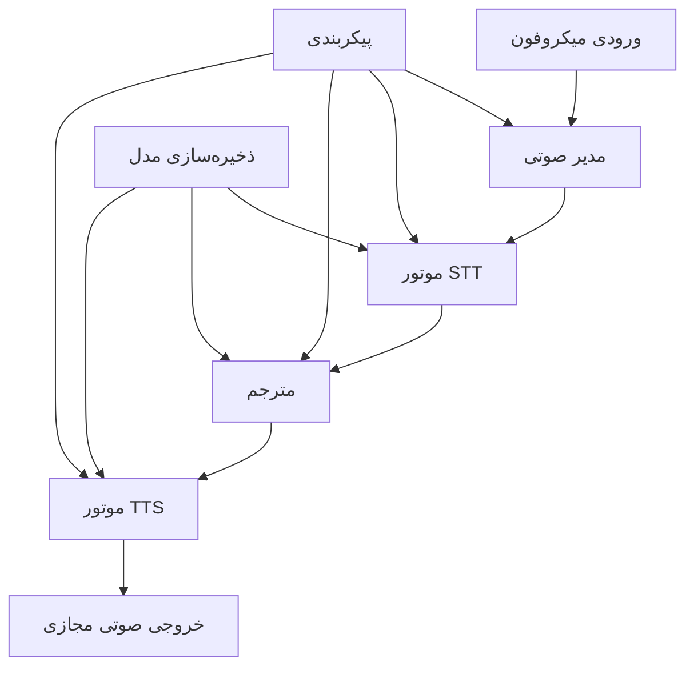
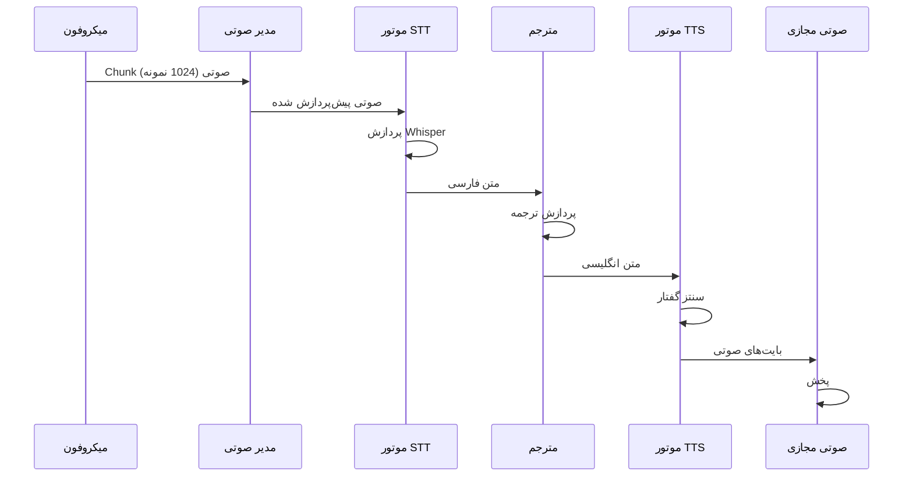
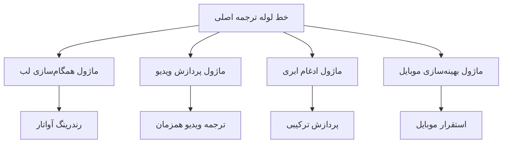

# مستندات معماری

## نمای کلی سیستم

VoiceBridge یک خط لوله ترجمه صوتی همزمان پیچیده پیاده‌سازی می‌کند که برای تأخیر کم و عملکرد آفلاین طراحی شده است. معماری از الگوی طراحی مدولار و رویدادمحور پیروی می‌کند که برای محیط‌های با منابع محدود بهینه‌سازی شده است.

## معماری سطح بالا



## اجزای اصلی

### 1. مدیر صوتی (`src/audio_handler.py`)

**هدف**: تمام عملیات ورودی/خروجی صوتی شامل ضبط میکروفون و خروجی دستگاه مجازی را مدیریت می‌کند.

**مسئولیت‌های کلیدی**:
- ضبط chunk صوتی همزمان از میکروفون
- پیش‌پردازش و نرمال‌سازی صوتی
- مدیریت دستگاه صوتی مجازی
- تبدیل فرمت صوتی و بافرینگ

**مشخصات فنی**:
- نرخ نمونه: 16kHz (قابل تنظیم)
- عمق بیت: 16-bit PCM
- کانال‌ها: مونو
- اندازه بافر: 1024 نمونه (قابل تنظیم)

**جریان داده**:
```
میکروفون → PyAudio Stream → آرایه NumPy → Chunk صوتی
```

### 2. موتور STT (`src/stt_engine.py`)

**هدف**: صوتی گفتار فارسی را با استفاده از مدل Whisper OpenAI به متن تبدیل می‌کند.

**مسئولیت‌های کلیدی**:
- تشخیص گفتار فارسی
- پیش‌پردازش صوتی برای Whisper
- نرمال‌سازی و پاک‌سازی متن
- امتیازدهی اعتماد

**پیکربندی مدل**:
- مدل پایه: Whisper Base (قابل تنظیم: tiny, base, small, medium, large)
- زبان: فارسی (fa)
- دقت: FP32 (سازگاری CPU)
- VAD: تشخیص فعالیت صوتی فعال

**ویژگی‌های عملکرد**:
- تأخیر: ~500ms برای صوتی 3 ثانیه‌ای
- دقت: >90% برای گفتار فارسی واضح
- استفاده از حافظه: ~1GB RAM

### 3. مترجم (`src/translator.py`)

**هدف**: متن فارسی را با استفاده از Hugging Face Transformers به انگلیسی ترجمه می‌کند.

**مسئولیت‌های کلیدی**:
- ترجمه ماشینی فارسی به انگلیسی
- پیش‌پردازش متن و tokenization
- بهینه‌سازی کیفیت ترجمه
- حفظ زمینه

**پیکربندی مدل**:
- مدل: Helsinki-NLP/opus-mt-fa-en
- فریمورک: Hugging Face Transformers
- Tokenization: SentencePiece
- پردازش دسته‌ای: بهینه‌سازی جمله واحد

**خط لوله ترجمه**:
```
متن فارسی → Tokenization → Encoder-Decoder → متن انگلیسی
```

### 4. موتور TTS (`src/tts_engine.py`)

**هدف**: متن انگلیسی را با استفاده از مدل XTTS-v2 و صدای کلون شده کاربر به گفتار تبدیل می‌کند.

**مسئولیت‌های کلیدی**:
- سنتز متن به گفتار انگلیسی با صدای کاربر
- کلون کردن صدا از نمونه 6 ثانیه‌ای
- پشتیبانی از 17 زبان مختلف
- تولید فرمت صوتی با کیفیت بالا

**پیکربندی مدل**:
- موتور: XTTS-v2 از Coqui
- صدا: کلون شده از نمونه کاربر (6 ثانیه)
- فرمت: WAV، 24kHz، 16-bit
- سنتز: Neural vocoder با قابلیت کلون صدا

**سخت‌افزار مورد نیاز**:
- GPU: NVIDIA RTX 3060 یا بالاتر (حداقل 6GB VRAM)
- RAM: حداقل 16GB، توصیه شده 32GB
- CPU: Intel i7 یا AMD Ryzen 7
- فضای ذخیره: 10GB برای مدل

**خط لوله صوتی**:
```
متن انگلیسی + نمونه صدای کاربر → XTTS-v2 → Neural Vocoder → بایت‌های صوتی
```

**قابلیت‌های جدید**:
- آپلود نمونه صدای کاربر از طریق رابط کاربری
- کلون صدا در زمان واقعی
- پشتیبانی از چندین نمونه صدای مختلف
- حفظ ویژگی‌های صوتی کاربر (تن، لهجه، احساسات)

## معماری جریان داده

### خط لوله پردازش همزمان



### مدل Threading

سیستم از معماری چند thread استفاده می‌کند تا عملکرد همزمان را تضمین کند:

1. **Thread اصلی**: مدیریت چرخه حیات برنامه
2. **Thread پردازش**: خط لوله ترجمه اصلی
3. **Thread صوتی**: ضبط و پخش مداوم صوتی

```python
# معماری Threading
Thread اصلی
├── Thread پردازش (خط لوله ترجمه)
├── Thread ضبط صوتی (میکروفون)
└── Thread پخش صوتی (دستگاه مجازی)
```

## مدیریت حافظه

### استراتژی بارگذاری مدل

مدل‌ها یک بار در طول راه‌اندازی بارگذاری می‌شوند و برای عملکرد بهینه در حافظه نگه داشته می‌شوند:

```python
# تخصیص حافظه برای هر مؤلفه
موتور STT:     ~1GB (Whisper Base)
مترجم:         ~500MB (Helsinki-NLP)
موتور TTS:     ~4GB (XTTS-v2 + GPU VRAM)
بافرهای صوتی:  ~50MB (بافرهای دایره‌ای)
مجموع:          ~5.5GB (بدون احتساب VRAM)
```

### مدیریت بافر

- **بافر ورودی صوتی**: بافر دایره‌ای برای ضبط مداوم
- **بافر پردازش**: ذخیره‌سازی موقت برای خط لوله ترجمه
- **بافر خروجی صوتی**: صف برای پخش گفتار سنتز شده

## معماری مدیریت خطا

### تخریب تدریجی

سیستم مکانیزم‌های fallback متعددی پیاده‌سازی می‌کند:

1. **شکست دستگاه صوتی**: fallback خودکار به دستگاه‌های پیش‌فرض
2. **خطای بارگذاری مدل**: تکرار با مدل‌های کوچک‌تر
3. **شکست ترجمه**: بازگشت متن اصلی با پرچم خطا
4. **شکست TTS**: خروجی متن به عنوان fallback

### بازیابی خطا

```python
# سلسله مراتب مدیریت خطا
try:
    # عملیات اصلی
except ModelError:
    # fallback به مدل کوچک‌تر
except AudioError:
    # تغییر به دستگاه صوتی جایگزین
except TranslationError:
    # بازگشت متن اصلی
except TTSError:
    # خروجی متن به جای صدا
```

## معماری پیکربندی

### پیکربندی متمرکز

تمام پارامترهای سیستم از طریق `config.py` مدیریت می‌شوند:

```python
# دسته‌بندی پیکربندی
AUDIO_CONFIG = {
    'sample_rate': 16000,
    'chunk_size': 1024,
    'channels': 1
}

MODEL_CONFIG = {
    'whisper_model': 'base',
    'translation_model': 'Helsinki-NLP/opus-mt-fa-en',
    'tts_model_path': 'models/en_US-amy-medium.onnx'
}

PERFORMANCE_CONFIG = {
    'max_latency': 2.0,
    'buffer_size': 4096,
    'thread_count': 4
}
```

## ملاحظات مقیاس‌پذیری

### مقیاس‌پذیری افقی

- **پشتیبانی چندزبانه**: بسته‌های زبان مدولار
- **انواع مدل**: اندازه‌های مختلف مدل برای سخت‌افزارهای مختلف
- **پردازش توزیع‌شده**: پشتیبانی آینده از استقرار ابری

### مقیاس‌پذیری عمودی

- **شتاب‌دهی GPU**: پشتیبانی CUDA برای مدل XTTS-v2 (اجباری)
- **بهینه‌سازی حافظه**: بارگذاری پویای مدل و مدیریت VRAM
- **بهینه‌سازی CPU**: پردازش چند هسته‌ای
- **کلون صدا**: پشتیبانی از چندین نمونه صدای مختلف

## معماری امنیت

### طراحی حریم خصوصی اول

- **پردازش محلی**: هیچ داده‌ای از دستگاه خارج نمی‌شود
- **بدون تماس شبکه**: عملکرد کاملاً آفلاین
- **پاک‌سازی حافظه**: پاک‌سازی امن بافرها
- **یکپارچگی مدل**: تأیید checksum

### حفاظت از داده

```python
# اقدامات امنیتی
- داده صوتی: پاک‌سازی پس از پردازش
- داده متنی: ذخیره‌سازی روی دیسک نمی‌شود
- داده مدل: دسترسی فقط خواندنی
- پیکربندی: رمزگذاری تنظیمات حساس
```

## گسترش‌های معماری آینده

### بهبودهای برنامه‌ریزی شده

1. **ادغام همگام‌سازی لب**: انیمیشن صورت همزمان
2. **ورودی چندوجهی**: پردازش ویدیو + صوتی
3. **محاسبات Edge**: استقرار موبایل و embedded
4. **ابر ترکیبی**: پردازش ابری اختیاری برای وظایف پیچیده

### گسترش‌های مدولار



## نظارت بر عملکرد

### جمع‌آوری معیارها

- **ردیابی تأخیر**: زمان پردازش انتها به انتها
- **نظارت بر منابع**: استفاده از CPU، حافظه و دیسک
- **معیارهای کیفیت**: دقت ترجمه و کیفیت صوتی
- **ردیابی خطا**: نرخ شکست و زمان بازیابی

### استراتژی‌های بهینه‌سازی

1. **کوانتیزاسیون مدل**: کاهش دقت برای استنتاج سریع‌تر
2. **پردازش دسته‌ای**: چندین chunk صوتی پردازش شده با هم
3. **کش**: ترجمه‌های مکرر کش شده
4. **بارگذاری پیش‌بینی‌ای**: مدل‌ها بر اساس الگوهای استفاده پیش‌بارگذاری

این معماری پایه‌ای محکم برای ترجمه صوتی همزمان فراهم می‌کند و در عین حفظ انعطاف برای بهبودها و بهینه‌سازی‌های آینده.
