# مستندات عملکرد

## نمای کلی

این سند تحلیل جامع عملکرد، استراتژی‌های بهینه‌سازی و نیازمندی‌های منابع برای سیستم ترجمه صوتی همزمان VoiceBridge ارائه می‌دهد. تمرکز بر دستیابی به حداقل تأخیر در عین حفظ دقت بالا در محیط‌های با منابع محدود است.

## معیارهای عملکرد

### شاخص‌های کلیدی عملکرد (KPI)

| معیار | هدف | دستیابی | یادداشت |
|--------|--------|----------|-------|
| **تأخیر انتها به انتها** | < 2.0s | ~1.8s | ورودی صوتی تا خروجی |
| **تأخیر STT** | < 0.5s | ~0.4s | تشخیص گفتار |
| **تأخیر ترجمه** | < 0.3s | ~0.25s | ترجمه متن |
| **تأخیر TTS** | < 0.5s | ~0.45s | سنتز گفتار |
| **استفاده از حافظه** | < 2GB | ~1.75GB | مصرف پیک RAM |
| **استفاده از CPU** | < 50% | ~35% | سیستم چهار هسته‌ای |
| **دقت** | > 90% | ~92% | تشخیص فارسی |

### تجزیه تأخیر

```mermaid
gantt
    title خط لوله ترجمه همزمان تأخیر
    dateFormat X
    axisFormat %L ms
    
    section ضبط صوتی
    ورودی میکروفون    :0, 50
    
    section پردازش STT
    پیش‌پردازش صوتی :50, 80
    استنتاج Whisper  :80, 480
    
    section ترجمه
    پردازش متن    :480, 520
    استنتاج مدل    :520, 770
    
    section پردازش TTS
    پردازش متن    :770, 800
    سنتز گفتار   :800, 1250
    
    section خروجی صوتی
    مدیریت بافر  :1250, 1280
    صوتی مجازی      :1280, 1800
```



## نیازمندی‌های منابع

### مشخصات سخت‌افزاری

#### حداقل نیازمندی‌ها
- **CPU**: دو هسته 2.0GHz (Intel i3 یا AMD Ryzen 3)
- **RAM**: 4GB DDR4
- **ذخیره‌سازی**: 2GB فضای آزاد (SSD توصیه می‌شود)
- **صوتی**: میکروفون و بلندگو داخلی

#### نیازمندی‌های توصیه شده
- **CPU**: چهار هسته 3.0GHz+ (Intel i5/i7 یا AMD Ryzen 5/7)
- **RAM**: 8GB+ DDR4
- **ذخیره‌سازی**: 5GB+ فضای آزاد (NVMe SSD)
- **صوتی**: میکروفون USB خارجی، بلندگو/هدفون با کیفیت
- **GPU**: اختیاری NVIDIA GPU با پشتیبانی CUDA

#### نیازمندی‌های عملکرد بالا
- **CPU**: 8 هسته 3.5GHz+ (Intel i7/i9 یا AMD Ryzen 7/9)
- **RAM**: 16GB+ DDR4
- **ذخیره‌سازی**: 10GB+ NVMe SSD
- **GPU**: NVIDIA RTX 3060+ با 8GB+ VRAM
- **صوتی**: میکروفون USB حرفه‌ای، مانیتور استودیو

### نیازمندی‌های نرم‌افزاری

#### سیستم‌عامل
- **Windows**: 10/11 (64-bit)
- **Linux**: Ubuntu 20.04+ (64-bit)
- **macOS**: 10.15+ (Intel/Apple Silicon)

#### محیط Python
- **Python**: 3.8+ (3.10+ توصیه می‌شود)
- **pip**: آخرین نسخه
- **محیط مجازی**: برای جداسازی توصیه می‌شود

## استراتژی‌های بهینه‌سازی عملکرد

### 1. بهینه‌سازی مدل

#### انتخاب مدل Whisper

| مدل | اندازه | تأخیر | دقت | حافظه | مورد استفاده |
|-------|------|---------|----------|--------|----------|
| tiny | 39MB | ~200ms | 85% | 200MB | همزمان، منابع کم |
| base | 74MB | ~400ms | 92% | 1GB | عملکرد متعادل |
| small | 244MB | ~600ms | 95% | 2GB | دقت بالا |
| medium | 769MB | ~1000ms | 97% | 4GB | حداکثر دقت |
| large | 1550MB | ~2000ms | 98% | 8GB | تحقیق/آفلاین |

**توصیه**: از مدل `base` برای تعادل بهینه سرعت و دقت استفاده کنید.

#### کوانتیزاسیون مدل

```python
# کوانتیزاسیون FP16 برای شتاب‌دهی GPU
model = whisper.load_model("base", device="cuda", fp16=True)

# کوانتیزاسیون INT8 برای بهینه‌سازی CPU
import torch.quantization
quantized_model = torch.quantization.quantize_dynamic(
    model, {torch.nn.Linear}, dtype=torch.qint8
)
```

#### کش مدل

```python
# بارگذاری مدل پایدار
import pickle
import os

def load_cached_model(model_name):
    cache_path = f"cache/{model_name}.pkl"
    if os.path.exists(cache_path):
        with open(cache_path, 'rb') as f:
            return pickle.load(f)
    else:
        model = whisper.load_model(model_name)
        os.makedirs("cache", exist_ok=True)
        with open(cache_path, 'wb') as f:
            pickle.dump(model, f)
        return model
```

### 2. بهینه‌سازی پردازش صوتی

#### مدیریت بافر

```python
class OptimizedAudioHandler:
    def __init__(self, chunk_size=1024, buffer_size=4096):
        self.chunk_size = chunk_size
        self.buffer_size = buffer_size
        self.audio_buffer = collections.deque(maxlen=buffer_size)
        
    def capture_chunk(self):
        # ضبط صوتی غیرمسدودکننده
        chunk = self.stream.read(self.chunk_size, exception_on_overflow=False)
        return np.frombuffer(chunk, dtype=np.int16)
```

#### پیش‌پردازش صوتی

```python
def optimize_audio_input(audio_chunk):
    # نرمال‌سازی سطح صوتی
    audio_chunk = audio_chunk.astype(np.float32) / 32768.0
    
    # اعمال کاهش نویز
    audio_chunk = apply_noise_reduction(audio_chunk)
    
    # تشخیص فعالیت صوتی
    if not detect_voice_activity(audio_chunk):
        return None
        
    return audio_chunk
```

### 3. بهینه‌سازی ترجمه

#### پردازش دسته‌ای

```python
class OptimizedTranslator:
    def __init__(self):
        self.translation_cache = {}
        self.batch_size = 4
        
    def translate_batch(self, texts):
        # پردازش چندین متن با هم
        results = self.model(texts, batch_size=self.batch_size)
        return [result['translation_text'] for result in results]
```

#### استراتژی کش

```python
import hashlib

def get_translation_cache_key(text):
    return hashlib.md5(text.encode()).hexdigest()

def translate_with_cache(self, text):
    cache_key = get_translation_cache_key(text)
    if cache_key in self.translation_cache:
        return self.translation_cache[cache_key]
    
    result = self.translator(text)
    self.translation_cache[cache_key] = result
    return result
```

### 4. TTS Optimization

#### Voice Model Selection

| Voice Model | Size | Quality | Latency | Use Case |
|-------------|------|---------|---------|----------|
| en_US-amy-low | 50MB | Good | ~200ms | Real-time |
| en_US-amy-medium | 100MB | High | ~400ms | Balanced |
| en_US-amy-high | 200MB | Excellent | ~600ms | Quality |

#### Streaming Synthesis

```python
class StreamingTTS:
    def __init__(self):
        self.piper = piper.Piper(model_path="models/en_US-amy-medium.onnx")
        
    def synthesize_streaming(self, text):
        # Synthesize in chunks for lower latency
        sentences = text.split('.')
        for sentence in sentences:
            if sentence.strip():
                yield self.piper.synthesize(sentence.strip())
```

## Memory Management

### Memory Allocation Strategy

```python
class MemoryManager:
    def __init__(self):
        self.model_memory = {}
        self.buffer_memory = {}
        self.max_memory = 2 * 1024 * 1024 * 1024  # 2GB
        
    def allocate_model_memory(self, model_name, size):
        if self.get_total_memory() + size > self.max_memory:
            self.cleanup_unused_models()
        self.model_memory[model_name] = size
        
    def cleanup_unused_models(self):
        # Implement LRU cleanup strategy
        pass
```

### Garbage Collection Optimization

```python
import gc

def optimize_garbage_collection():
    # Force garbage collection after each translation cycle
    gc.collect()
    
    # Configure garbage collection thresholds
    gc.set_threshold(700, 10, 10)
```

## CPU Optimization

### Multi-threading Strategy

```python
import concurrent.futures
import threading

class ThreadedProcessor:
    def __init__(self, max_workers=4):
        self.executor = concurrent.futures.ThreadPoolExecutor(max_workers=max_workers)
        self.audio_queue = queue.Queue(maxsize=10)
        self.result_queue = queue.Queue(maxsize=10)
        
    def process_audio_pipeline(self, audio_chunk):
        # Process STT, Translation, and TTS in parallel where possible
        stt_future = self.executor.submit(self.stt_engine.transcribe, audio_chunk)
        stt_result = stt_future.result()
        
        if stt_result:
            translation_future = self.executor.submit(self.translator.translate, stt_result)
            translation_result = translation_future.result()
            
            if translation_result:
                tts_future = self.executor.submit(self.tts_engine.synthesize, translation_result)
                return tts_future.result()
```

### CPU Affinity

```python
import psutil
import os

def set_cpu_affinity():
    # Bind process to specific CPU cores
    process = psutil.Process(os.getpid())
    process.cpu_affinity([0, 1, 2, 3])  # Use cores 0-3
```

## GPU Acceleration

### CUDA Optimization

```python
import torch

def setup_cuda_optimization():
    if torch.cuda.is_available():
        # Enable CUDA optimizations
        torch.backends.cudnn.benchmark = True
        torch.backends.cudnn.deterministic = False
        
        # Set memory allocation strategy
        torch.cuda.empty_cache()
        torch.cuda.set_per_process_memory_fraction(0.8)
```

### Mixed Precision Training

```python
from torch.cuda.amp import autocast, GradScaler

def optimized_inference(model, input_data):
    with autocast():
        return model(input_data)
```

## Performance Monitoring

### Real-time Metrics

```python
import time
import psutil
import threading

class PerformanceMonitor:
    def __init__(self):
        self.metrics = {}
        self.monitoring = False
        
    def start_monitoring(self):
        self.monitoring = True
        monitor_thread = threading.Thread(target=self._monitor_loop)
        monitor_thread.daemon = True
        monitor_thread.start()
        
    def _monitor_loop(self):
        while self.monitoring:
            self.metrics.update({
                'cpu_percent': psutil.cpu_percent(),
                'memory_percent': psutil.virtual_memory().percent,
                'timestamp': time.time()
            })
            time.sleep(1)
```

### Latency Profiling

```python
import functools
import time

def profile_latency(func):
    @functools.wraps(func)
    def wrapper(*args, **kwargs):
        start_time = time.perf_counter()
        result = func(*args, **kwargs)
        end_time = time.perf_counter()
        
        latency = end_time - start_time
        print(f"{func.__name__} latency: {latency:.3f}s")
        
        return result
    return wrapper

# Usage
@profile_latency
def transcribe(self, audio_data):
    return self.model.transcribe(audio_data)
```

## Benchmarking

### Performance Test Suite

```python
import unittest
import time
import numpy as np

class PerformanceTests(unittest.TestCase):
    def setUp(self):
        self.stt_engine = STTEngine()
        self.translator = Translator()
        self.tts_engine = TTSEngine()
        
    def test_stt_latency(self):
        # Generate test audio
        audio_data = np.random.randint(-32768, 32767, 48000, dtype=np.int16)
        
        start_time = time.perf_counter()
        result = self.stt_engine.transcribe(audio_data)
        end_time = time.perf_counter()
        
        latency = end_time - start_time
        self.assertLess(latency, 0.5, "STT latency should be under 500ms")
        
    def test_translation_latency(self):
        test_text = "سلام دنیا"
        
        start_time = time.perf_counter()
        result = self.translator.translate(test_text)
        end_time = time.perf_counter()
        
        latency = end_time - start_time
        self.assertLess(latency, 0.3, "Translation latency should be under 300ms")
```

## Troubleshooting Performance Issues

### Common Performance Problems

1. **High Latency**
   - Reduce model size
   - Decrease chunk size
   - Enable GPU acceleration
   - Optimize audio preprocessing

2. **High Memory Usage**
   - Use smaller models
   - Implement model caching
   - Optimize buffer sizes
   - Enable garbage collection

3. **CPU Overload**
   - Reduce thread count
   - Optimize audio processing
   - Use CPU affinity
   - Enable model quantization

4. **Poor Audio Quality**
   - Increase sample rate
   - Use higher quality TTS model
   - Optimize audio preprocessing
   - Check microphone quality

### Performance Tuning Checklist

- [ ] Model size optimized for hardware
- [ ] Audio buffer sizes tuned
- [ ] Threading configuration optimized
- [ ] Memory usage monitored
- [ ] GPU acceleration enabled (if available)
- [ ] Caching strategies implemented
- [ ] Garbage collection optimized
- [ ] Performance monitoring active

This performance documentation provides comprehensive guidance for optimizing LinguaStream's real-time translation capabilities while maintaining high accuracy and resource efficiency.
